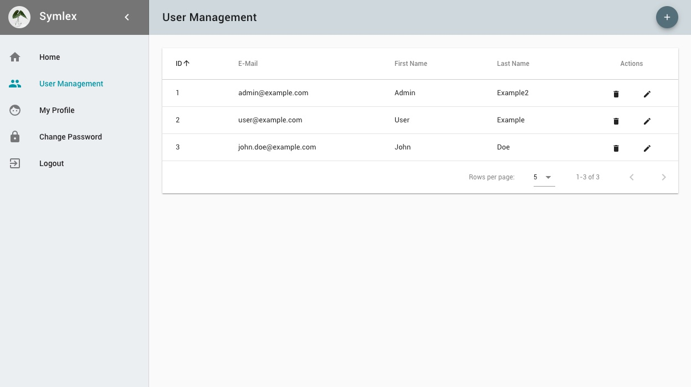

# User Interface

Our boilerplate code located in the `frontend` directory is there for your convenience and puts you straight on track for 
building impressive single-page applications with [Webpack](https://webpack.js.org/), [Vue.js](https://vuejs.org/) and [Vuetify](https://vuetifyjs.com/en/). 

## Frameworks ##

[Vuetify](https://vuetifyjs.com/en/getting-started/quick-start) is a powerful open-source [Material Design](https://material.io/) UI component framework for building modern single-page applications.

It is based on [VueJS](https://vuejs.org/v2/guide/), a JavaScript library that combines the best ideas from [AngularJS](https://angularjs.org/) (Google) and [React](https://reactjs.org/) (Facebook); development is community driven and the API fairly stable.

Vuetify and VueJS are initialized in [frontend/src/app.js](https://github.com/symlex/symlex/blob/master/frontend/src/app.js). [Webpack](https://webpack.js.org/concepts/) is used as a module loader / bundler. It creates single, optimized JS and CSS files in the server assets public build directory from the original source code. You can find the build configuration in `frontend/webpack.config.js`.

## Building ##

A build can be triggered by running `npm run dev` (watches for changes and re-builds when needed) or `npm run build` (single build) in the **frontend directory**. 

[NPM](https://www.npmjs.com/) is the default package manager that comes with [NodeJS](https://nodejs.org/en/docs/guides/), a JavaScript run-time environment that executes JavaScript code outside of a browser. We only use it as a task runner in this project. Dependencies should be installed and updated using [Yarn](https://yarnpkg.com/en/docs/getting-started). It is compatible with NPM, but faster and better suited for front-end development.

## Dependencies ##

The full list of dependencies can be found in `frontend/package.json`. You need to run `yarn install` in the **frontend directory** to install them (automatically happens during installation, see `build.xml`). Run `yarn add [package name]` to add a new package (library or framework).
