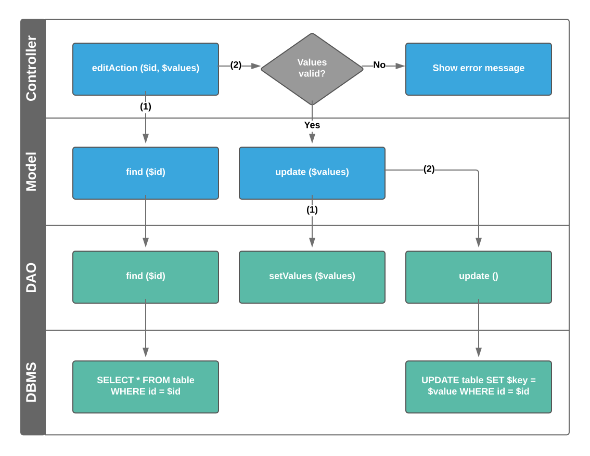

# Models and Database Abstraction

Symlex isn't designed for any specific database abstraction layer or model library. 
Our examples are based on MySQL and [Doctrine ActiveRecord](../doctrine-active-record.md). 

As a lightweight alternative to Doctrine ORM, this library provides Business Model and Database Access Object (DAO) classes that encapsulate Doctrine DBAL to provide high-performance, object-oriented CRUD (create, read, update, delete) functionality for relational databases. It is a lot faster and less complex than Datamapper ORM implementations.

## Business Models

Models are logically located between Controllers - which render views and validate user input - and Data Access Objects (DAOs), that are low-level interfaces to a storage backend or Web service.

Public interfaces of models are high-level and should reflect all use cases within their domain:
 
!!! example
    ```php
    <?php
    
    namespace App\Model;
    
    use App\Exception\InvalidArgumentException;
    use Doctrine\DBAL\Exception\UniqueConstraintViolationException;
    
    class User extends ModelAbstract
    {
        protected $_daoName = 'User';
    
        public function updatePassword($password)
        {
            if (strlen($password) < 8) {
                throw new InvalidArgumentException('Password is too short');
            }
    
            $hash = password_hash($password, PASSWORD_DEFAULT);
    
            $this->getDao()->userPassword = $hash;
            $this->getDao()->userPasswordResetToken = null;
            $this->getDao()->userVerificationToken = null;
            $this->getDao()->update();
        }
    }
    ```
    
## Data Access Objects

DAOs directly deal with database tables and raw SQL, if needed. `Doctrine\ActiveRecord\Dao\Dao` is suited to implement custom methods using raw SQL
while `Doctrine\ActiveRecord\Dao\EntityDao` offers many powerful methods to easily deal with database table rows:

!!! example
    ```php
    <?php
    
    namespace App\Dao;
    
    class UserDao extends DaoAbstract
    {
        protected $_tableName = 'users';
        protected $_primaryKey = 'userId';
        protected $_timestampEnabled = true;
    
        protected $_formatMap = [
            'userId' => Format::INT,
            'userRole' => Format::STRING,
            'userNewsletter' => Format::BOOL,
        ];
    
        protected $_hiddenFields = [
            'userPassword',
            'userPasswordResetToken',
            'userVerificationToken',
        ];
    }
    ```
    
## Workflow

This diagram illustrates how Controller, Model, DAO and database interact with each other:

